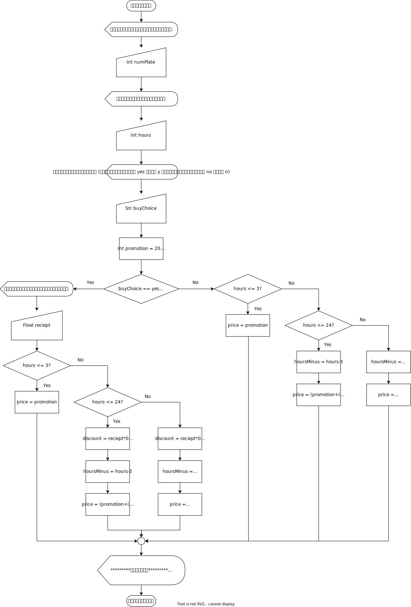

# คำนวณค่าจอดรถ
อาจารย์สั่งงานให้ลองใช้การตัดสินใจในรูปแบบ **[Nested If](https://www.w3schools.com/python/gloss_python_if_nested.asp)**

## โจทย์
จงเขียนโปรแกรมคิดค่าบริการเช่าที่จอดรถยนต์โดยมีเงื่อนไขว่า 3 ชั่วโมงแรก 20 บาท ชั่วโมงถัดไปคิดชั่วโมงละ 20
บาท โดยสามารถนำ ใบเสร็จการซื้อสินค้ามาเป็นส่วนลดได้โดยคิดจาก 5% จากราค่าสินค้าที่ซื้อ แต่ 3 ชั่วโมงแรกไม่
สามารถใช้ส่วนลดได้ถ้าจอดเกิน 24 ชั่วโมง ให้คิดชั่วโมงละ 20 บาทตั้งแต่ชั่วโมงแรก  เป็นต้น มาพร้อมคิดค่าปรับเพิ่ม
ชั่วโมงละ 10 บาท และสามารถใช้ใบเสร็จในการซื้อสินค้ามาเป็นส่วนลดได้เช่นกัน โดยระบบต้องสามารถรับจำนวน
ชั่วโมงสุดทธิที่จอดรถ พร้อมทะเบียนรถยนต์แล้วแสดงผลลัพธ์แจ้งค่าบริการสุทธิแ

## วิเคราะห์
### ทำความเข้าใจปัญหา
รับค่าทะเบียนรถยนต์ จำนวนชั่วโมงที่จอดรถยนต์ และจำนวนเงินที่ชำระในใบเสร็จในการสั่งซื้อ มาคำนวนค่าจอดรถยนต์พร้อมทั้งแสดงผลค่าทะเบียนรถยนต์ จำนวนชั่วโมงที่จอดรถยนต์ และจำนวนเงินที่ต้องชำระ
### วิเคราะห์ตามส่วนประกอบ
- **หน่วยนำเข้า**
    - ทะเบียนรถยนต์
    - จำนวนชั่วโมงที่จอดรถยนต์
    - จำนวนเงินในใบเสร็จที่ซื้อของ
- **หน่วยประมวลผล**
    - แบบที่ 1: โปรโมชั่นจอดรถยนต์ 3 ชม.
    - แบบที่ 2: โปรโมชั่นจอดรถยนต์ 3 ชม. + (จำนวนเวลาที่ลบจากโปรโมชั่นที่ไม่เกิน 24 ชม. * 20)
    - แบบที่ 3: โปรโมชั่นจอดรถยนต์ 3 ชม. + (จำนวนเวลาที่ลบจากโปรโมชั่นที่ไม่เกิน 24 ชม. * 20) - (จำนวนเงินในใบเสร็จที่ซื้อของ * 0.05)
    - แบบที่ 4: โปรโมชั่นจอดรถยนต์ 3 ชม. + (21 * 20) + (ชั่วโมงที่เกิน * ค่าปรับ)
    - แบบที่ 5: โปรโมชั่นจอดรถยนต์ 3 ชม. + (21 * 20) + (ชั่วโมงที่เกิน * ค่าปรับ) - (จำนวนเงินในใบเสร็จที่ซื้อของ * 0.05)
- **หน่วยการตัดสินใจ**
    - ใบเสร็จในการซื้อของ == มี:
        - ชั่วโมงการจอดรถยนต์ <= 3 ชม. : แบบที่ 1
        - ชั่วโมงการจอดรถยนต์ <= 24 ชม. : แบบที่ 3
        - ชั่วโมงการจอดรถยนต์ > 24 ชม. : แบบที่ 5
    - ใบเสร็จในการซื้อของ == ไม่มี:
        - ชั่วโมงการจอดรถยนต์ <= 3 ชม. : แบบที่ 1
        - ชั่วโมงการจอดรถยนต์ <= 24 ชม. : แบบที่ 2
        - ชั่วโมงการจอดรถยนต์ > 24 ชม. : แบบที่ 4
- **หน่วยแสดงผล**<br>
    ```cmd
    *********ใบเสร็จ*********
    ทะเบียนรถยนต์: {numPlate}
    ส่วนลดที่ได้รับ: {discount} บาท
    ค่าใช้จ่ายที่ต้องชำระ: {price} บาท
    ***********************
    ```
### อัลกอริทึม

### ผังงาน


## ออกแบบและผลลัพธ์
```````
tiwazzz@PC:~/Documents/GitHub/102_carpark_with_nested_if$ python3 main.py 
ป้อนเลขทะเบียนรถยนต์: 12344
ชั่วโมงการจอดรถยนต์: 12
ได้ซื้อของหรือไม่ (หากใช่ให้พิมพ์ yes หรือ y หากไม่ใช่ให้พิมพ์ no หรือ n): y
กรุณาป้อนยอดใบเสร็จของคุณ: 2400

*********ใบเสร็จ*********
ทะเบียนรถยนต์: 12344
ส่วนลดที่ได้รับ: 120.0 บาท
ค่าใช้จ่ายที่ต้องชำระ: 80.0 บาท
************************
```````